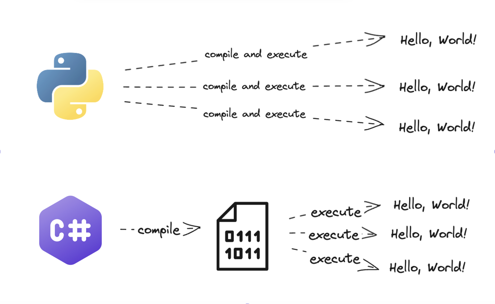

# Running C#

In this bite, you will learn how to run C# code using `dotnet`. If you'd prefer to watch a
video version of this, skip down to the [demonstration](#demonstration). (We 
still recommend that you follow along, to ensure that your C# installation is
set up correctly.)

## Introduction

Running C# programs with `dotnet` is pretty straightforward.

First, open a terminal and navigate to `csharp_fundamentals/bites/examples/CSharp.RunningCode`. Then you can run some Java code that we wrote:

```shell
# You should see a "Hello, World!" message printed to your terminal when you do this
; dotnet run Program.cs
```

## A Note on Compilation

C# is often described as a compiled language, which means _all the code_ of 
your program is converted (compiled) into a lower-level language (that is 
understood by processors) before anything else happens. After compilation, the 
code can be repeatedly executed without the need for repeated compilation.

This is different to languages like Python, that compile and execute in 
something more like real-time every time you want to run the code.



> The important thing here is that you know C# compilation and execution are 
> two different steps and that your code will be compiled, in its entirety, 
> before being executed. Later on we'll see how things can go wrong at either 
> point.

## Demonstration

[Demonstration Video]()

[Next Challenge](02_writing_csharp_bite.md)

<!-- BEGIN GENERATED SECTION DO NOT EDIT -->

---

**How was this resource?**  
[😫](https://airtable.com/shrUJ3t7KLMqVRFKR?prefill_Repository=makersacademy%2Fcsharp-fundamentals&prefill_File=bites%2F01_running_csharp_bite.md&prefill_Sentiment=😫) [😕](https://airtable.com/shrUJ3t7KLMqVRFKR?prefill_Repository=makersacademy%2Fcsharp-fundamentals&prefill_File=bites%2F01_running_csharp_bite.md&prefill_Sentiment=😕) [😐](https://airtable.com/shrUJ3t7KLMqVRFKR?prefill_Repository=makersacademy%2Fcsharp-fundamentals&prefill_File=bites%2F01_running_csharp_bite.md&prefill_Sentiment=😐) [🙂](https://airtable.com/shrUJ3t7KLMqVRFKR?prefill_Repository=makersacademy%2Fcsharp-fundamentals&prefill_File=bites%2F01_running_csharp_bite.md&prefill_Sentiment=🙂) [😀](https://airtable.com/shrUJ3t7KLMqVRFKR?prefill_Repository=makersacademy%2Fcsharp-fundamentals&prefill_File=bites%2F01_running_csharp_bite.md&prefill_Sentiment=😀)  
Click an emoji to tell us.

<!-- END GENERATED SECTION DO NOT EDIT -->
