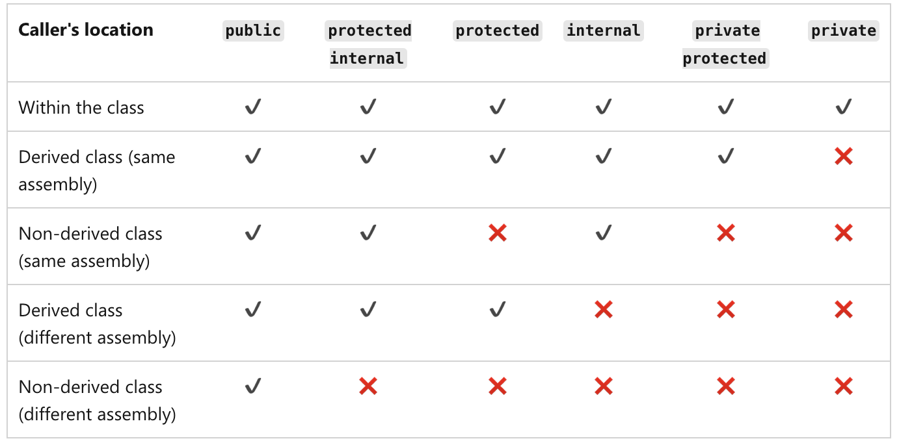

# Multi-class Applications

_**This is a Makers Bite.** Bites are designed to train specific skills or
tools. They contain an intro, a demonstration video, some exercises with an
example solution video, and a challenge without a solution video for you to test
your learning. [Read more about how to use Makers
Bites.](https://github.com/makersacademy/course/blob/main/labels/bites.md)_

In this bite, you will learn how to make several classes work together. This will require you to learn about two things...

1. Access modifiers
2. How to use one class from inside another class

## Introduction

You'll be pleased to know that in terms of the code which you'll need to write, everything here is pretty straightforward. There is, however, a little bit to get your head around conceptually.

### Access Modifiers

In C#, classes, methods and fields can all be implemented in different ways to determine where they can and can't be used. For example a `public` class can be used anywhere in its own _assembly_ (such as the Console Application in which its defined) or in another assembly (such as another Console Application). An `internal` class, however, can only be used within its own assembly.

The most restrictive access modifier is `private`, which means something can only be used within the class in which its declared.

There are 6 different access modifiers in C#. The table below, [which I've pinched from the docs](https://learn.microsoft.com/en-us/dotnet/csharp/programming-guide/classes-and-structs/access-modifiers#summary-table), shows a summary of them all but, for now, you'll only need `private` and `internal`.



<br>
<details>
  <summary>
    Which access modifier should you be using in this section?
  </summary>
  <p>
    If you want to implement multiple classes which work together, and we're choosing between <code>private</code> or <code>internal</code>, you'll need to use <code>internal</code>... BUT... try using <code>private</code> to see what happens :)
  </p>
</details>
<br>

You might be wondering what the defaults access modifier is. Well.. it depends! For classes and methods it's `internal` but for fields, it's `private`. Luckily, the compiler and / or your IDE will make it very clear when you use an access modifier that is too restrictive.

<code style="color: red">
/Users/eddie/development/CSharp.StaticMethods/Program.cs(6,14): error CS0122: 'Post.Print()' is inaccessible due to its protection level [/Users/eddie/development/csharp/CSharp.StaticMethods/CSharp.StaticMethods.csproj]

The build failed. Fix the build errors and run again.
</code>

<br>
<details>
  <summary>
    To which file and line does the error point?
  </summary>
  <p>
    <code style='color: red'>Program.cs(6,14)</code> points to line 6 in the <code>Program</code> class.
  </p>
</details>
<br>

### Using a class from inside another class

In this case, it's just like Python.

Define your classes, then use one inside the other, like this.

```cs
// Post.cs - the class defaults to `internal`
class Post {

  // fields would default to `private`
  internal string content;
  internal string author;

  // this method would default to `private`
  internal Post(string content, string author) {
    this.content = content;
    this.author = author;
  }
}
```

For consistency and completeness, you should also add access modifiers to your `Program` class.

```cs
// Program.cs - a class that can only be used from within this Console Application
class Program {
  // this method defaults to `private` but that's OK
  static void Main(string[] args) {
    // create a new instance of Post
    Post birthday = new Post("Happy Birthday", "Conchita");
    // do something with it
    Console.WriteLine(birthday.content);
  }
}
```

And that's it! :)

## Demonstration

[Demonstration Video](https://youtu.be/jAB5rTNDB8I)

## Exercise

Define a class called `Bagel` which has three instance methods:

* `seeds`   -> returns a `String` describing what seeds are on the bread.
* `filling` -> returns a `String` describing what is inside the bagel.
* `price`   -> returns an `Integer` representing the price of this tasty Bagel.

Call each instance method inside the `Main` method of your `Program` class and print the return values.


[Next Challenge](07_arithmetic_bite.md)

<!-- BEGIN GENERATED SECTION DO NOT EDIT -->

---

**How was this resource?**  
[😫](https://airtable.com/shrUJ3t7KLMqVRFKR?prefill_Repository=makersacademy%2Fcsharp-fundamentals&prefill_File=bites%2F06_multi_class_applications_bite.md&prefill_Sentiment=😫) [😕](https://airtable.com/shrUJ3t7KLMqVRFKR?prefill_Repository=makersacademy%2Fcsharp-fundamentals&prefill_File=bites%2F06_multi_class_applications_bite.md&prefill_Sentiment=😕) [😐](https://airtable.com/shrUJ3t7KLMqVRFKR?prefill_Repository=makersacademy%2Fcsharp-fundamentals&prefill_File=bites%2F06_multi_class_applications_bite.md&prefill_Sentiment=😐) [🙂](https://airtable.com/shrUJ3t7KLMqVRFKR?prefill_Repository=makersacademy%2Fcsharp-fundamentals&prefill_File=bites%2F06_multi_class_applications_bite.md&prefill_Sentiment=🙂) [😀](https://airtable.com/shrUJ3t7KLMqVRFKR?prefill_Repository=makersacademy%2Fcsharp-fundamentals&prefill_File=bites%2F06_multi_class_applications_bite.md&prefill_Sentiment=😀)  
Click an emoji to tell us.

<!-- END GENERATED SECTION DO NOT EDIT -->
