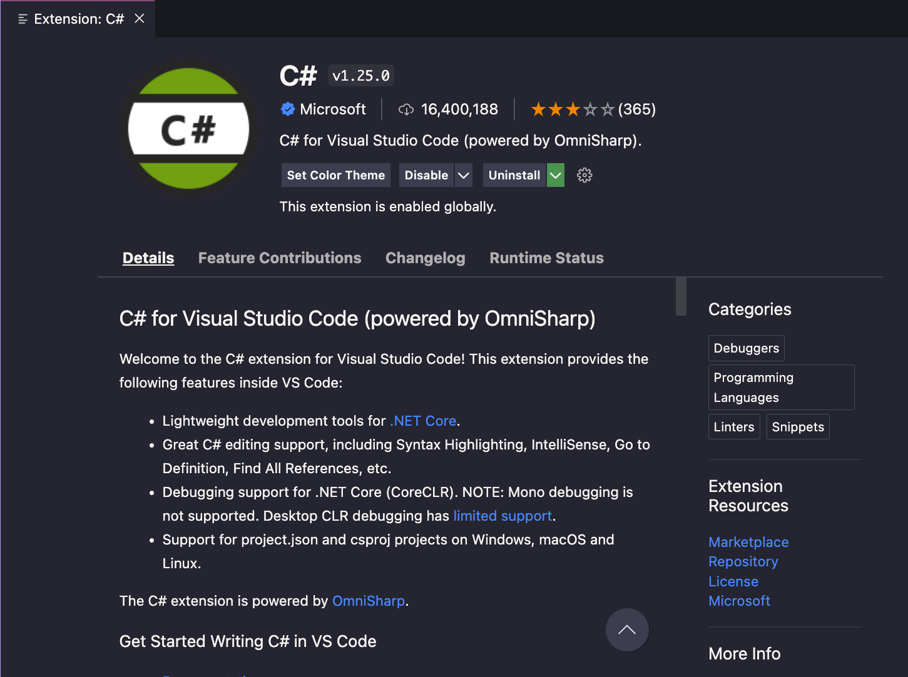

# Using an IDE

<!-- OMITTED -->

Many C# engineers don't use the terminal directly to compile and run C# code. When our program is split across many different files and folders, it can become unpractical to run the `dotnet` command directly. Most of the time, you'd use an IDE to write C# programs. There are a couple of different IDEs available to us, in this section we'll use Visual Studio code with the extension ['C# for Visual Studio Code (powered by OmniSharp)'](https://marketplace.visualstudio.com/items?itemName=ms-dotnettools.csharp).

  * Install the extension
  * Install also the extension [.NET Core Test Explorer](https://marketplace.visualstudio.com/items?itemName=formulahendry.dotnet-test-explorer) that we'll use in the next section.

  

You might need to reload or restart VS code after installing those.

Next, let's create a new project called `Calculator` (`dotnet new console --name Calculator`) and open this directory in VS code. Create a new file `Calculator.cs` containing the class definition we used in the first section, and make sure it's called from your Program class.

If the C# extension is installed correctly, you should be able to Generate C# Assets for Build and Debug from the VS Code Run & Debug sidebar entry.

Once that's done, you should just need to hit the green triangle in the top left (or press `F5` on your keyboard):

Clicking `Run` should compile and run the class thanks to the VS code extension. The terminal will open and display the program output:

You'll see there's quite a lot there, but you'll eventually learn to interpret and use the extra information provided.

<!-- OMITTED -->

In the following sections, we'll always use the same terminology to describe the following actions:
  * "Run the program/app" will mean running the `Main` method with VS code — as explained above.
  <!-- OMITTED -->
  * "Run the tests" will mean running a specific test suite with VS code — we'll cover this in the next section.

[Next Challenge](04_testing_with_nunit.md)

<!-- BEGIN GENERATED SECTION DO NOT EDIT -->

---

**How was this resource?**  
[😫](https://airtable.com/shrUJ3t7KLMqVRFKR?prefill_Repository=makersacademy/csharp-apprenticeship-module&prefill_File=main/03_ide.md&prefill_Sentiment=😫) [😕](https://airtable.com/shrUJ3t7KLMqVRFKR?prefill_Repository=makersacademy/csharp-apprenticeship-module&prefill_File=main/03_ide.md&prefill_Sentiment=😕) [😐](https://airtable.com/shrUJ3t7KLMqVRFKR?prefill_Repository=makersacademy/csharp-apprenticeship-module&prefill_File=main/03_ide.md&prefill_Sentiment=😐) [🙂](https://airtable.com/shrUJ3t7KLMqVRFKR?prefill_Repository=makersacademy/csharp-apprenticeship-module&prefill_File=main/03_ide.md&prefill_Sentiment=🙂) [😀](https://airtable.com/shrUJ3t7KLMqVRFKR?prefill_Repository=makersacademy/csharp-apprenticeship-module&prefill_File=main/03_ide.md&prefill_Sentiment=😀)  
Click an emoji to tell us.

<!-- END GENERATED SECTION DO NOT EDIT -->
