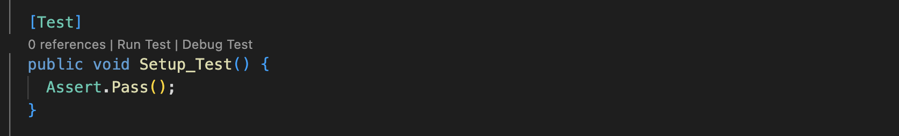
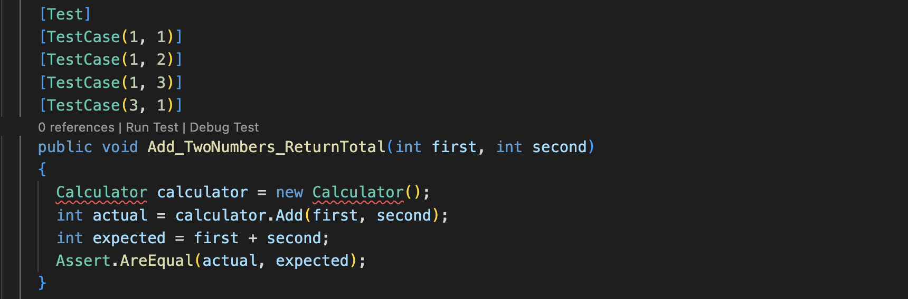

# Testing with NUnit

In C#, like in other programming languages, we can test-drive our programs to make sure we're building the right thing and that, later on, we don't accidentally break it.

> I.e. Test driving helps us to maintain high-quality code in a project.

We'll be using the NUnit library to write tests. 

## One Major Difference

When test driving a C# application, you'll need to create two different projects - one for your app and the other for your tests. These two projects are brought together by a solution.

For now, that's all you need to know about solutions :)

## Getting Started With NUnit

We've created a [template][tdd_template] for you to use in the exercises below. [Here's a video][nunit_setup] of that process.

[tdd_template]: ./exercises/csharp_tdd_intro/README.md
[nunit_setup]: https://youtu.be/jg80CVIwt8U

## Your First NUnit Tests

The tests for exercise 1 have already been written (though some are commented out). The first one looks like this.

It's a simple, actually quite silly, test but that makes it a good place to start. Let's pick it apart.

- `[Test]` is a special tag, called an _attribute_ which indicates that what follows is a test and that it should be executed as part of the test suite.
- `Setup_Test` is a regular C# method, which will be executed as a test.
- `Assert` is a class from the _nunit_ framework. You can use it to make lots of different assertions. Here we use `Assert.pass()` to implement a test that will always pass. Some commonly used, and much more meaningful, assertions are listed below.

> Below, `actual` is the value returned by the method under test and `expected` is the value that you are expecting.

* Assert.AreEqual(expected, actual)
* Assert.isTrue(actual)
* Assert.isFalse(actual)

Now let's look at a more complex example.

Again, we see the `[Test]` attribute. This time, since the test is doing something useful and it's name is descriptive of that. `Add_TwoNumbers_ReturnTotal` follows the format `MethodUderTest_StateUnderTest_ExpectedBehaviour`.

`Calculator calculator = new Calculator()` creates a new instance of the `Calculator` class and assigns it to a variable called `calculator`. It's a little more verbose than Ruby because we have to declare what _type_ of thing a variable will hold. This is done on the left hand side, with `Calculator calculator`. The first part, with capital `C`, is the type declaration and the second part, with lower case `c` is the name of the variable.

After that, we execute the method under test `Calculator.Add(1,1)` and assert that the return value is 2. There are some small differences between this example and what we actually use in the exercise, so let's deal with those now by looking at that final version.

One really nice feature of NUnit is that you can run the same test multiple times, using different inputs to the method under test, without writing out what is almost exactly the same test, repeatedly. This feature is called _parameterised testing_, because the different inputs are provided as parameters to the test method. Let's dig into that now.

You shouldn't be surprised to see the `[Test]` attribute being used again. If we didn't use it, the following method would not be run as part of the test suite. After that, we see some more attributes, all of which include `TestCase` – these are the various inputs that will be used for the test. As you can see, 4 test cases (different sets of inputs) have been declared. Now compare the method name in this (third) image with the method name in the second image.

In this image, the method test method `Add_TwoNumbers_ReturnTotal` takes two arguments `first` and `second`. These are the inputs from each test case and you can see that they're then used when executing the method under test `calculator.Add(first, second`.

Because the `actual` and `expected` values are now dynamic, based on the inputs, they both need to be generated. As before, the `actual` value is returned by `calculator.Add` and the `expected` value is generated in the test, manually.

**Now you're ready to do exercise 1!**

> BUT, BE WARNED: Don't jump right into parameterised testing, when writing your own tests. Always start with a simple test and build on that, until you become very confident with NUnit.

## Exercise 1: Calculator

1. [Set up](./exercises/csharp_tdd_intro/README.md#getting-started)
2. Run the initial tests using `dotnet test`
3. Uncomment the commented out tests in `./exercises/csharp_tdd_intro/Calculator.Tests/CalculatorTests.cs`
4. Run the tests again - some should fail
5. Implement a calculator class in `./exercises/csharp_tdd_intro/Calculator/Calculator.cs` to make all the Calculator tests pass.

> Note that your `Add` method is going to return an `int` :)

## Exercise 2: PriceDisplay

Let's now revisit the `PriceDisplay` exercise from the first section. Instead of doing everything in the `Main` method, this time we're going to TDD a `GetPriceLabel` method that does the same job:
  * it takes two arguments — an item name and a price
  * it returns the string `"The price for item: <item name> is <price>"`

To complete this exercise, you'll have to:
  * write a test for `GetPriceLabel` in `./exercises/csharp_tdd_intro/PriceDisplay.Tests/PriceDisplayTests.cs`
  * implement the `PriceDisplay` class, with a working `GetPriceLabel` method in `./exercises/csharp_tdd_intro/PriceDisplay/PriceDisplay.cs` to make the test pass

## Exercise 3: Debugging

Another developer attempted to build a Calculator, with tests, but it's not gone to plan. You can find their code in `./exercises/csharp_tdd_intro/BrokenCalculator`.

1. Make sure the initial test runs
2. Uncomment the code in `BrokenCalculator.cs` and `BrokenCalculatorTests.cs`
3. Find and fix the bug in `BrokenCalculator.cs` to make the `BrokenCalculatorTests` pass

## Stretch Exercise: To-do List

In this exercise, you'll build a small To-do List application.

1. Set up projects called `ToDo` and `ToDoTests` then add them both to the existing solution.
2. Write tests for a `Todo` class such as:
   * it is initialised with an empty list of tasks.
   * it has a `AddTask` method that takes a `string` argument and adds it to the list of tasks.
   * it has a `GetTasks` method that returns the list of tasks.
3. Implement the `Todo` class to those tests pass.

[Next Challenge](05_challenge_game.md)

<!-- BEGIN GENERATED SECTION DO NOT EDIT -->

---

**How was this resource?**  
[😫](https://airtable.com/shrUJ3t7KLMqVRFKR?prefill_Repository=makersacademy/csharp-apprenticeship-module&prefill_File=main/04_testing_with_nunit.md&prefill_Sentiment=😫) [😕](https://airtable.com/shrUJ3t7KLMqVRFKR?prefill_Repository=makersacademy/csharp-apprenticeship-module&prefill_File=main/04_testing_with_nunit.md&prefill_Sentiment=😕) [😐](https://airtable.com/shrUJ3t7KLMqVRFKR?prefill_Repository=makersacademy/csharp-apprenticeship-module&prefill_File=main/04_testing_with_nunit.md&prefill_Sentiment=😐) [🙂](https://airtable.com/shrUJ3t7KLMqVRFKR?prefill_Repository=makersacademy/csharp-apprenticeship-module&prefill_File=main/04_testing_with_nunit.md&prefill_Sentiment=🙂) [😀](https://airtable.com/shrUJ3t7KLMqVRFKR?prefill_Repository=makersacademy/csharp-apprenticeship-module&prefill_File=main/04_testing_with_nunit.md&prefill_Sentiment=😀)  
Click an emoji to tell us.

<!-- END GENERATED SECTION DO NOT EDIT -->
